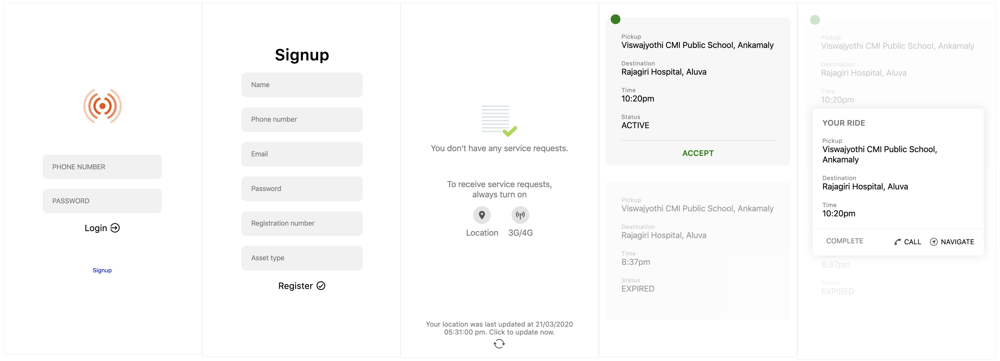
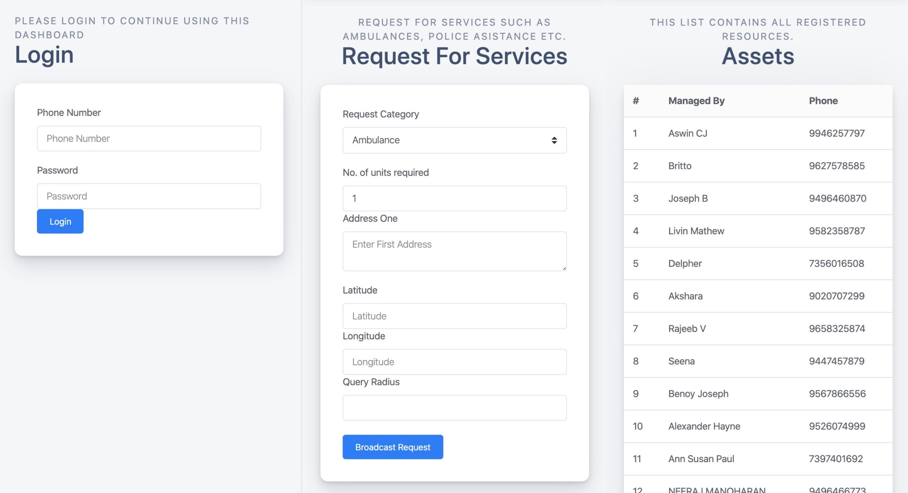

# Ambulance Network

### Asset tracker app

The Asset tracker app is designed to track moving assets such as ambulances, Police vehicles, food trucks etc. We will be using it to create an Ambulance Network for CCCs.

**Ambulance tracker**  
When a Corona Care Center places a request for an ambulance, the system locates the closest available ambulances and sends them a request. The pickup location of the affected person and the destination hospital is sent to the driver. The app then triggers navigation via Google Maps to help the driver get to the pickup and destinations

**Signup and login**  
After installation, the drivers are asked to sign up to the Ambulance network. Information collected from them during sign up includes name, phone number, email, password, asset registration number and asset type \(in this case, an ambulance\).

The users are then prompted to enable mobile data \(3G/4G\) and location services. The app periodically updates the location of the ambulance on the server.

**Service requests**  
When a driver gets a new request, he can choose to accept or ignore it. The backend-system keeps notifying drivers until one of them accepts the request.

A request contains information like the pickup location, destination, time of request and status of the request. Once a request has been served by any of the drivers, it is marked as expired.

CCCs can also send out requests for multiple ambulances. In this case, drivers can keep accepting rides until the required amount is reached.

**Requirements**  
1. API to determine the destination hospital  
2. A telephone number for the CCC that initiates the request - This may be required in case the driver has any queries, or to let the POC know that he has arrived at the pickup point.

**Caveats**  
1. Always on location & data  
****We need to ensure that all assets with tracker apps keep both location services and cellular data \(3G/4G\) on at all times.

1.1. People who've not enabled location services in a long time may need to step outdoors to register accurate GPS coordinates. Have included UX elements to make the user do this.

2. Battery charge &gt; 50%  
The devices need to maintain &gt;50% battery charge. Popular Android devices in India are aggressively optimised for battery. When the battery charge drops, location services will be turned off automatically by Android. Hence it is imperative that devices stay charged.

To to deal with these caveats, we've tailored the user experience in such a way that the users are constantly reminded of these requirements.

### Assets Dashboard

