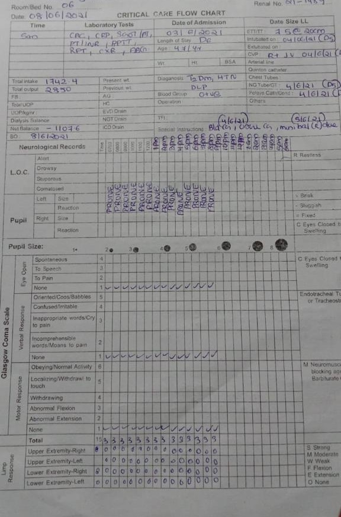
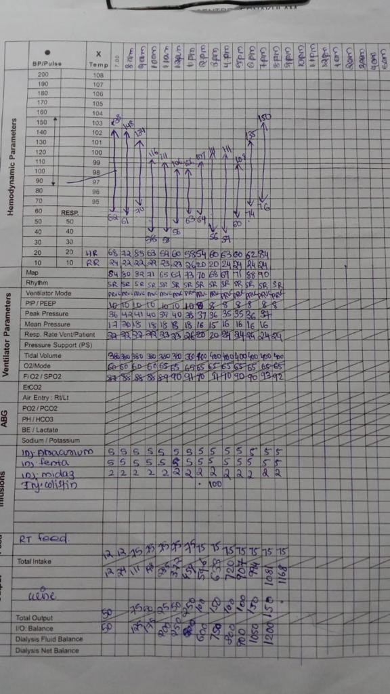

# Critical Care

Around 10% of patients who get Covid require Critical Care but this infrastructure is woefully short in many parts of India. 
  
To get over this crisis, Vinod Khosla, founder of Sun Microsystems and Khosla Ventures co-founded the 10BedICU project. along with Srikanth Nadhamuni, founding CTO of Aadhaar, India’s National Identity project. 


This breakthrough project aims to fund the creation of 10 Bed ICU in nearly 200-300 districts which cover rural and remote parts of India.


Since India has less than 5000 Intensivists/ doctors who specialise in intensive care units, there is absence of a specialist doctor at remote areas. 

To overcome this challenge using technology, CoronaSafe’s student developers are working with Srikanth Nadhamuni to build new tooling that would allow for remote ICU care. 

A patient's information/vitals from the ICU in a remote area would be captured, formatted into a UI that can be seen by a specialist anywhere in the world, who can then guide the junior doctors at these critical care facilities on patient treatment.

## The current critical care flow chart

## Digital Version





  
  
A detailed explanation of each input. [Link](https://docs.google.com/spreadsheets/u/1/d/e/2PACX-1vTqV1adSFDg0I4g4_oUn8jBBQYr7zubxPlCYQFKHmfQaiCzxYthJSD8xbFmDJWTLfyVqXUwKCzSYh2W/pubhtml?gid=0&single=true)

