# Palliative/Homecare System

## **Project Outline**

### **Introduction**:

NHM wants to create a Central software system wherein they’re able to digitalise patient management for set categories \(set categories like palliative/homecare, psychiatry, dialysis, infectious diseases etc\).

NHM also wants to integrate other existing systems like telemedicine, sample management, U4HE - United for Healthy Ernakulam \(a system that integrates private hospitals\), CARE etc to this system. Idea is to keep this system we’re trying to create as the backbone to whichever subsets we may want to attach to it later.

To begin with, prioritising Palliative Care/Homecare as a subset, let’s discuss what's expected.

### _**Some Jargons:**_

**Community Nurse/Primary nurse:** Designated nurse for a PHC, who is specialized in palliative care/home care.

**Specialist Nurse/Secondary nurse:** Designated nurse for CHCs, who is more qualified/specialised.

**G.H team:** The team - which trains the nurses and controls the system entirely based on requirements

**RRT team:** Rapid response team is the smallest action team within a ward. It contains a ward member, ASHA, Kudumbashree ADS person and an Anganwadi teacher.

**M.O:** Medical Officer is the doctor in charge in every Panchayat/Periphery.

**PHC/FHC \(Primary/Family Health Center\):** Every panchayat has a primary health center. Panchayat is a collection of wards, wherein a ward has a population of 250-400 families. Every PHC has a community nurse - pertaining to their area. Apart from a Primary nurse, PHC will have;

* a Medical Officer \(doctor\),
* a HI \(Health Inspector\),
* a JHI \(Junior Health Inspector\),
* 4-5 JPHNs \(Junior Public Health Nurse\).

Apart from Community nurse, all other categories are Govt employees, Community nurse is tagged to NHM on contract basis for an year.

**UPHC \(Urban PHC\):** Instead of panchayats, in Corporation we have municipalities - which are larger in population than panchayats. In every municipality, we have UPHCs \(under NHM\). In Ernakulam, there are 16 UPHCs, Cochin Corporation has 14 UPHCs, 1 UPHC each in Tripunithura and Kalamassery Municipality. Same staff roles as a regular PHC is available in UPHC, however with more staff count.

**CHC \(Community Health Center\):** Few panchayats will collectively have a **CHC**, wherein a Specialist Nurse and a Physiotherapist will be available, along with a Community nurse. Here Specialist nurse will attend to serious cases, Community nurse will attend to patients in the area wherein the CHC is located. Apart from the Physiotherapist, Primary & Secondary nurse tagged to NHM, CHC will have;

* 2-3 Medical officers
* Nurse Superintend
* Staff nurse
* 1 HI
* 1-2 JHI
* LHI \(Lady Health Inspector\)
* Health Supervisor \( He/she is tagged to a block, meaning 2-3 CHCs will have a common Health Supervisor\)

### **Current Process:**

Community nurse in a PHC maintains a few registers;

1. **Primary Nominal register** \(kept within PHC/CHC/G.H\)

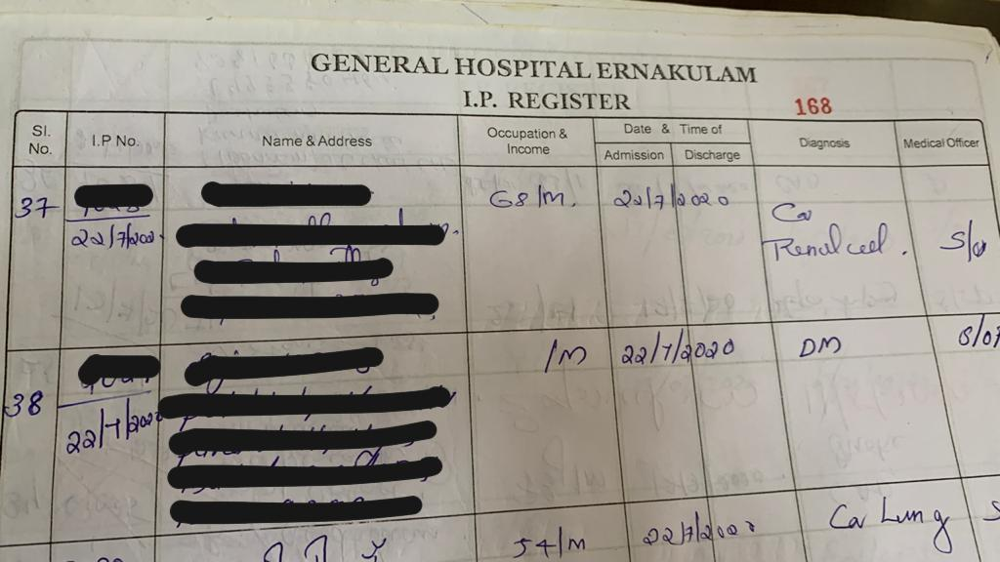

Note: In G.H \(General Hospital Ernakulam\), as some patient’s come from other districts, they keep a **separate O.P register** - for patients who get diagnosed and later they will be referred to respective PHC in their panchayat. Such patients visit G.H as it’s nearer for them.

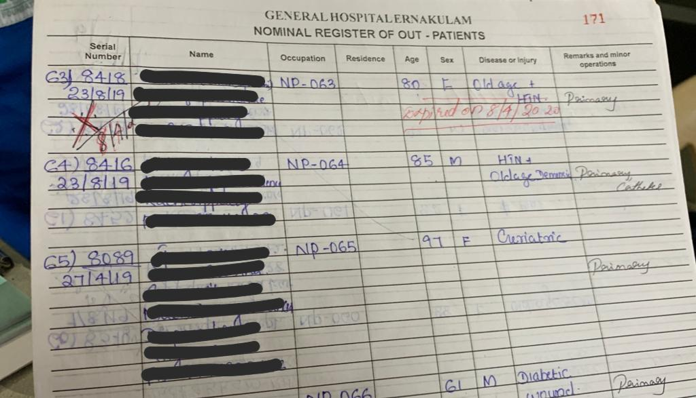

2. Only if the patient needs homecare, the patient's name is added to the **Primary Follow up** register. In case after treatment, if the patient needs no homecare - patient’s follow up will be tagged as SOS.

2.1 Primary nurse’s follow up register - also called **Primary Follow up register**

2.2 Secondary nurse’s follow up register - called **Secondary follow up register**

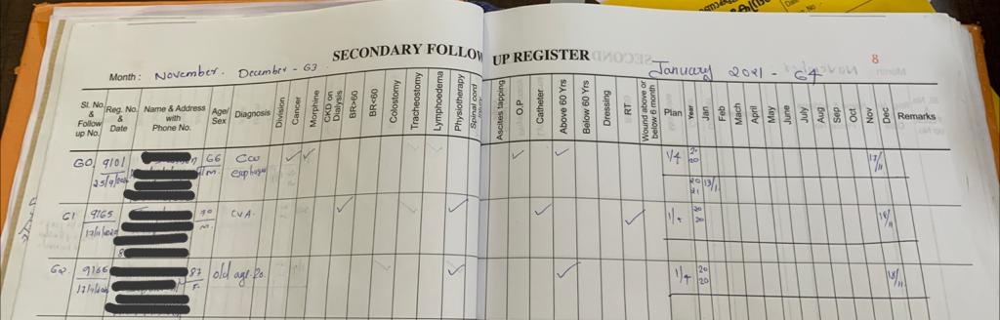

3. **Patient Treatment Summary** sheet: Each patient has a case sheet which is maintained within PHC/CHC. This contains the information - on patient history with milestones. Past records of the patient - pertaining to homecare/palliative. Let’s say for eg if patient had cancer, we need to have - \(also attaching samples below\)

- Date of diagnosis

- First treatment summary \(on Chemo-therapy\)

- His condition after chemo

- Latest treatment summary

- Patient’s family tree

- Other details \(details on what the form captures  below\) -

* Images of **Primary Treatment Summary** sheet : for Primary nurse -

 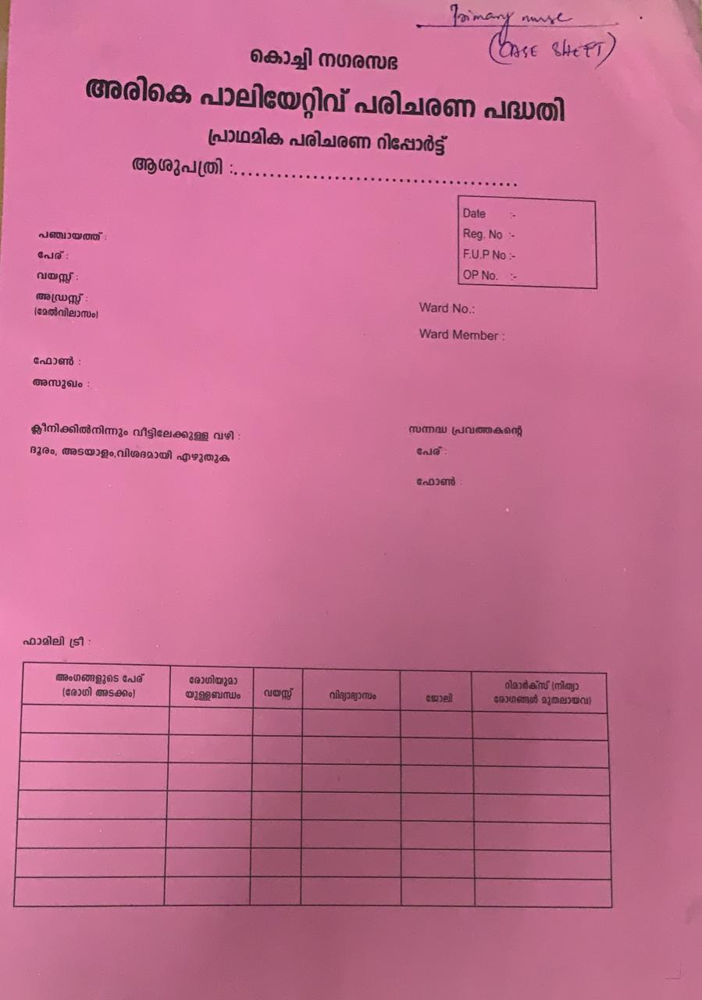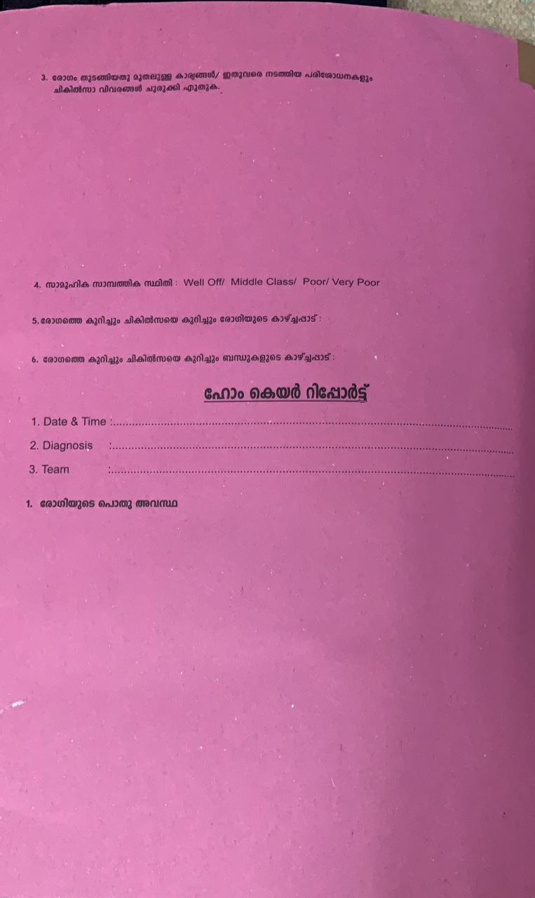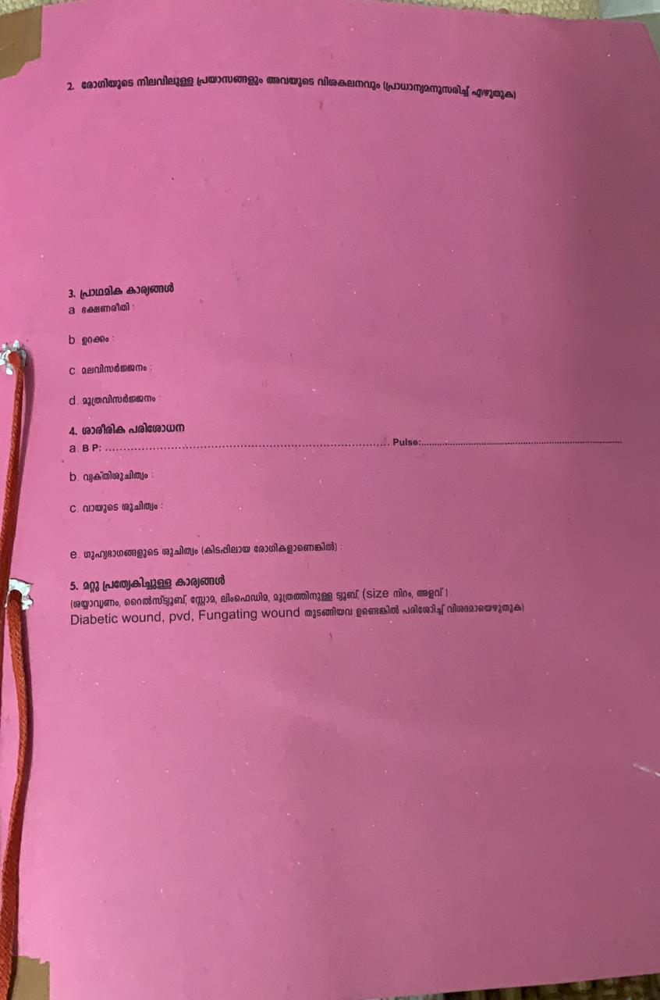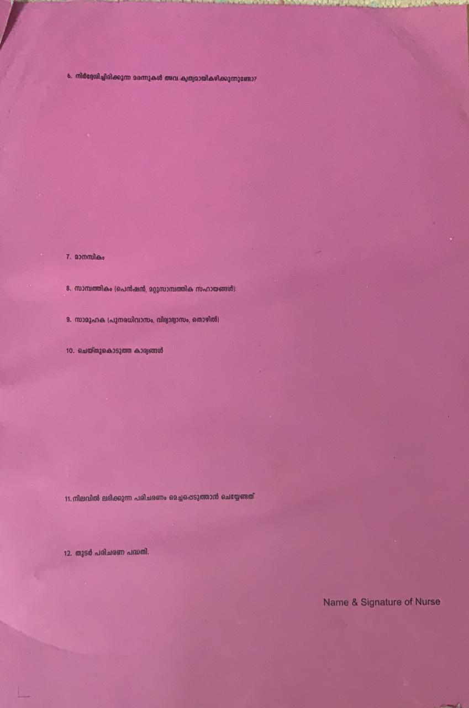

* Images of **Secondary Treatment Summary** card: for Secondary nurse -

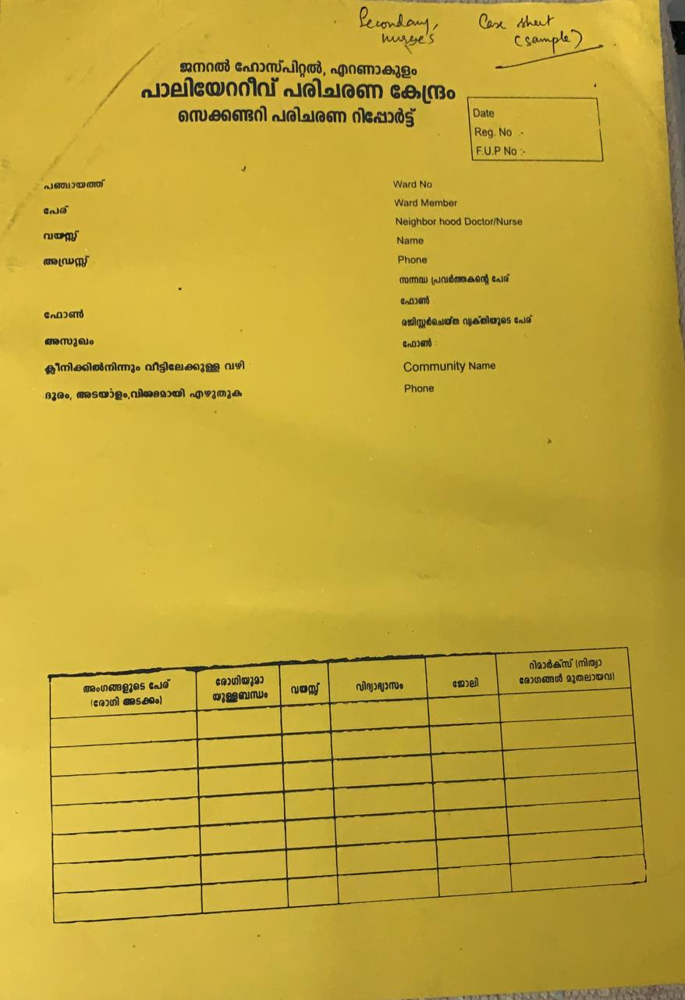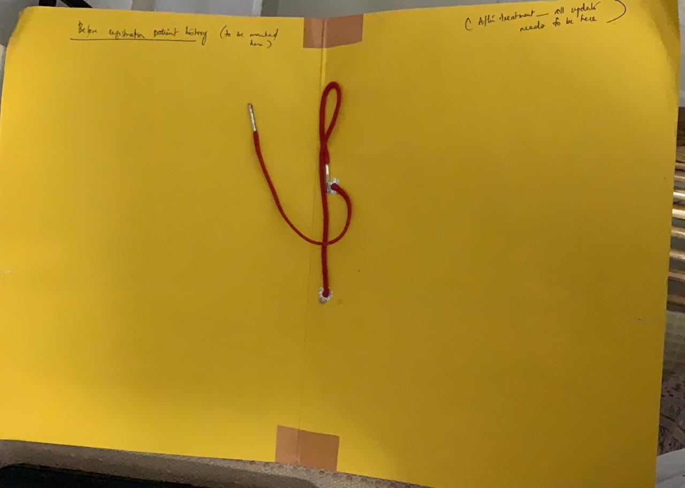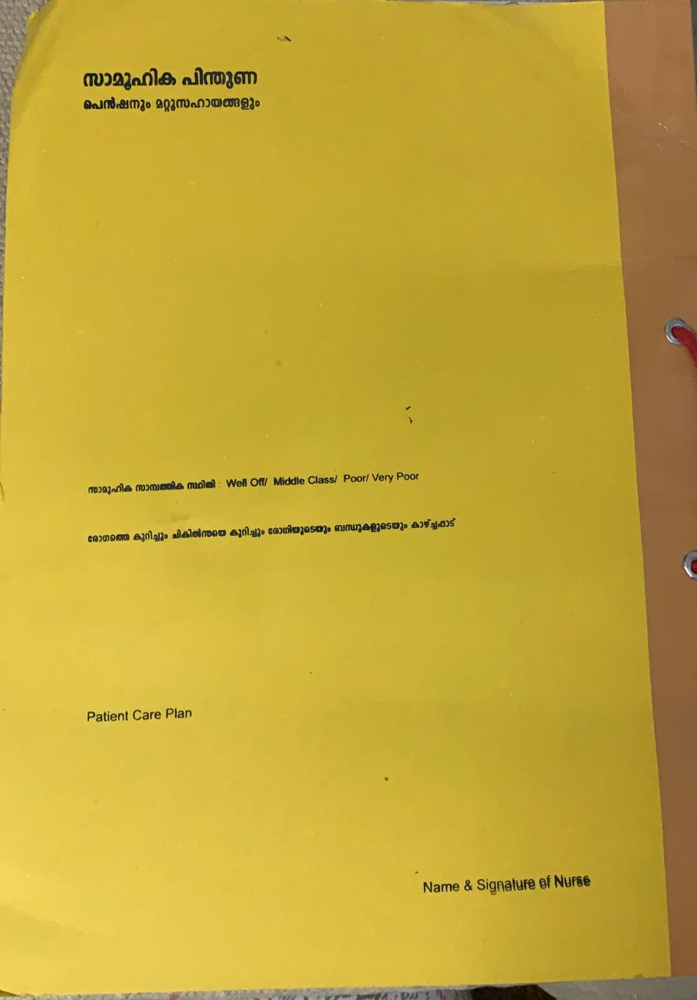

4. Inside both kinds of **treatment summary sheets**, there are **reports** \( reports are common for Primary and Secondary nurses\), which look like -

* Treatment report is a one page file which is updated every month/bi-weekly/weekly/daily - depending on the patient's health condition. Details in such a report are;

  1. Register no
  2. Date
  3. Patient’s general health status
  4. Patient’s current difficulties, diagnosis
  5. Primary details -
     1. Food habits
     2. Sleep
     3. Excretion
     4. Urination
  6. Physical examination
     1. BP
     2. Pulse
     3. GRBS
     4. GRBS
     5. Personal hygiene
     6. Mouth hygiene
     7. Pubic hygiene
  7. Medicines
  8. Treatment summary
  9. Care Plan

  **Sample** of a report below - 

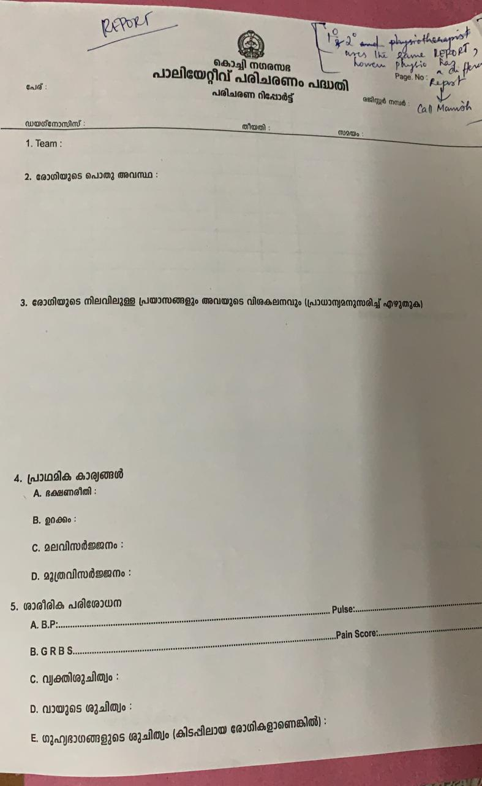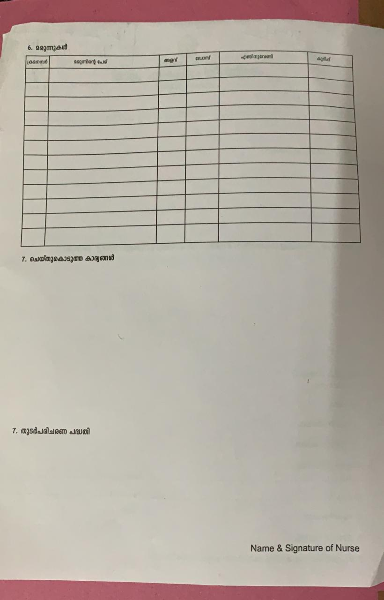

6. In case if primary nurse suggests that treatment needs to be done by a secondary nurse, the primary nurse can refer to the corresponding CHC’s secondary nurse.

7. Sometimes in CHC, the physiotherapist will be involved in providing reports and suggesting the way forward for patients. He has a different report - \(yet to be added\)

8. In CHCs, if the Medical officer \(doctor\) in charge - if needed, takes cares of the patient - this **doctor's report** is added to the **Primary/Secondary Treatment Summary card** too -

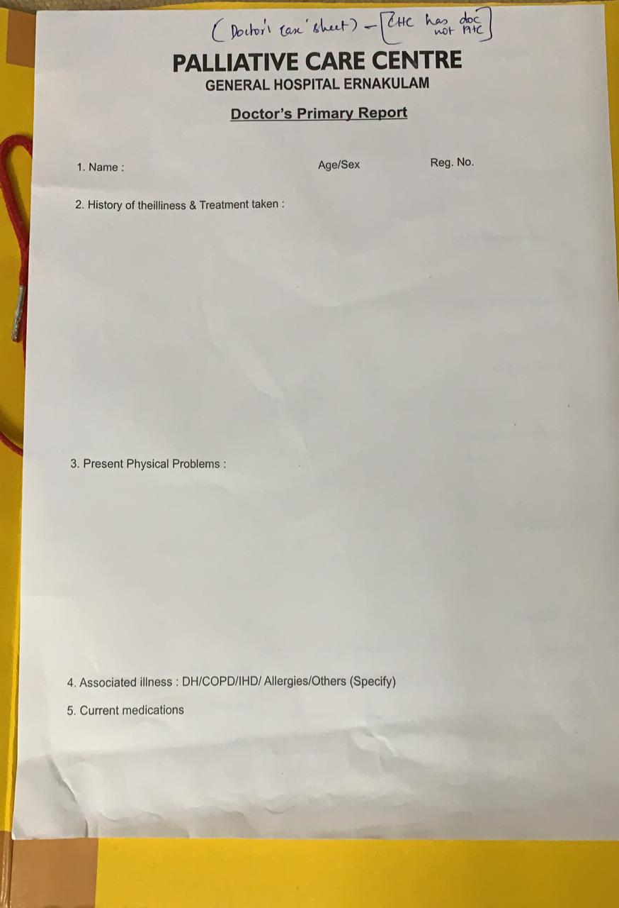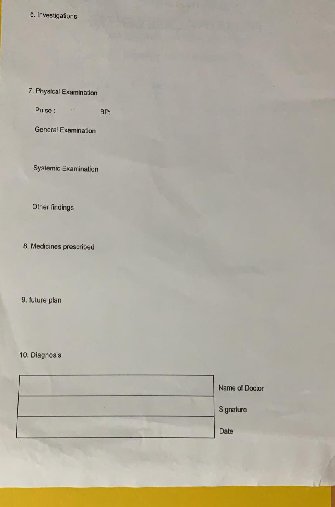

So, to summarize, the community nurse visits patients in a particular locality every month. Currently, the community nurse has to go through every case sheet - need to segregate patients based on locality and then see who needs care urgently from these records manually, and visit maximum 8 of them in a day. While visiting, if a patient needs expert care, they note it down and inform their corresponding specialist nurse to visit this patient. In case the patient visits CHC, medical officer/physiotherapist’s care is provided to the patient and the reports they use are provided above.

There are 18,000 such patients in Ernakulam currently, excluding the floating population. If we can bring a platform to handle this, patient numbers will be more than 50,000.

**Disadvantages of current process:**

1. Manual process of writing down patient details in paper cards - which can easily be ruined/lost.
2. Patient history and medical condition is only available on the paper card. There is no way a central team can look into this.
3. Biggest issue to sorting this based on disease type and area. Planning for a visit in itself takes up 1-2 days of their time. Everytime the nurse has to manually sit down and segregate the cards based on;

3.a Area

3.b Criticality of the patient to be visited

3.c Review date

4. Even if they plan their visit, sometimes patients come in an impromptu basis - so planning wisely is difficult.

5. Sometimes, OP patients come in and do not bring their report \(patient has a booklet - which is a copy of their treatment summary\). In such cases - they duplicate the case sheet and the former case sheet and the important notes in it may be missed.

6. Specialist nurse needs to be informed over the phone on what condition the patient is in, it’s a time delayed process to visit the patient who needs expert care - and tracking the same is also manual.

1. Every time a nurse visits patients, the records of such visits are manual and there is no standardized way of tracking it, checking what status it was etc.
2. The socio-economic status of the patient is never visible to the G.H team who may have funds to support, but has no real clarity who needs it.

**Proposed Central System with subset - Palliative Care:**

As this system serves as the backbone of all systems, common functionalities can be kept exclusive, like;

1. Panchayat
2. Ward
   1. Ward number
   2. Ward member
   3. ASHA’s name
   4. Kudumbashri’s name
   5. Anganwadi’s name
3. Patient demographics \(basic details of patient\)
   1. Name
   2. Age
   3. Address
   4. Phone
   5. Disease
   6. Route map from clinic to home - exact location
4. Neighbourhood doctor
   1. Name
   2. Phone
5. Volunteer from his locality \( there’re 2 volunteers assigned for every 50 houses in a ward\). Volunteers need to be able to sign up - tagging their ward. Slowly we need to make view access available to volunteers - as to who’re homecare patients near them.
   1. Name
   2. Phone
6. Community nurse\*
   1. Name
   2. Phone

Also need to specifically mention the **Health** and **Revenue** division to which each patient belongs for clarity. Each ward can be tagged to its subsequent block - this can be pre-filled based on the patient's ward and this list can be obtained from Dr Athul. Let’s say for eg: PHC Chovvara \(we may mention both its health and revenue block - to avoid confusion

**Challenges here:**

1. Major challenge is that the way patients are tagged to PHC → CHC → Taluk → Zila → GH →Medical college is different for each set category. For example, the way it’s tagged for a homecare patient differs from psychology/infectious disease. We need to define it separately.
2. For the floating population, these details keep changing - we need to be mindful of that aspect too.

**Hierarchy:**

There are three edit access levels needed here -

1. **Primary**: This access is for the community nurse who visits the patients every month. She needs to be able to create and maintain case sheets, treatment reports within the system - \( same details as mentioned in current process\). Additionally;
   1. Add the patient's financial status \(Well off/ Middle class/Poor/Very poor\). This is for the purpose of identifying who may need more financial support by the G.H team\* - sensitive information
   2. Patient’s other concerns can be tracked - could be emotional, socio-economic. Whether this needs to be in patient demographics or not - needs to be confirmed \(also - this needs to be invisible to the patient, visible to the higher team - so that they get to decide as to what needs the patient has. Money, support etc\)\* - sensitive information
   3. Psychological support \(nurse can assess if the patient’s situation needs this support and suggest a volunteer to meet him/her. Details that can be captured are below\)
      1. Does the patient require support
      2. How often
      3. Available time slots
   4. View pop ups of patients based on;
      1. Due date \(one month post her previous visit\) - if review date is missed, let’s mark this in red and display ‘review missed on x-date’.
      2. Area \(ward would suffice\)
      3. Criticality of medical condition \(i’ll create a list with critical ones, medium critical and low - possibly. When a nurse selects an area - our system can maybe show critical patients in that ward+nearby wards. That way - nurse can see who needs urgent care and decide to club trips\)
2. **Secondary**: This access is for the Specialist nurse, who needs to visit patients who need expert care. Patient card should be easily accessible for the secondary nurse. Just as much a primary nurse uses the system, a secondary nurse would do too.
3. **Tertiary**: This access is for Specialist nurse + G.H team. They also need edit access to provide expert advice to nurses - if need be.

* 1. Physiotherapist needs to create a treatment report too - if need arises
  2. Medical officers who do OP in PHC/CHC should also have access to this - to mark OP details. Their treatment report is different. Details below -
     1. History of illness and treatment taken
     2. Present physical problems
     3. Associated illnesses
     4. Current medications
     5. Investigations
     6. Physical examinations
        1. Pulse
        2. BP
        3. General examination
        4. Systemic examination
        5. Other findings
     7. Medicines prescribed
     8. Future plan
     9. Diagnosis

1. **View Access:**
   1. Patients need to have access to their basic case sheet - using a QR code/mobile phone authentication or so. This can be accessed over phone - whenever they visit regular hospitals - to show what their case history is.
   2. The RRT team needs to have view access.
   3. Other staff in PHC/CHC needs to have access.

**Projects other than palliative/homecare:**

_Community Mental health program_: There are 20 centers which have this pgm. Community nurse + volunteer goes and meets patients, details of the patient are taken and medication/treatment is done and then they return. Only after a month, they visit again. The follow ups in between have to be done locally. The way PHCs are tagged to CHCs are different compared to Homecare.

_Early Intervention program_: There are 10 such centers which have this program - process is similar to above mentioned. However, the way PHCs are tagged to CHCs are different here. Also the data is much more sensitive - so tech has to be kept that way.

The idea is to show what’s happening with the patient within Panchayat \(PHC\). Suppose the patient is moved to GH for palliative care, the card will be in GH only, however, view should be enabled for his panchayat so that they’re informed/data remains transparent.

