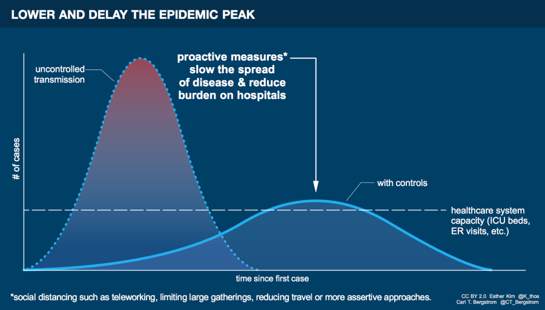

# Covid 19 Spread Modelling

**Goal:** To create a decision-making framework for public authorities to actively intervene and manage the spread of COVID19 outbreak.

COVID-19 cases will soon explode into unprecedented levels and we need to fltatten the       data to facilitate decision making for public health department to respond effectively.

> "To minimize the impact of the coming pandemic, we need to slow its spread and thereby keep our healthcare systems from being overwhelmed. Through aggressive measures we can flatten out the epidemic curve, keeping the number of people simultaneously infected at a low enough level to be manageable." - **Carl Bergstorm, Professor of Biology, University of Washington**

> “If you look at the curves of outbreaks, they go big peaks, and then come down. What we need to do is flatten that down.” - **Anthony Fauci, Director of the National Institute of Allergy and Infectious Diseases**

## Tentative Task List

* [ ] Create evolution curves for COVID-19 cases with confidence intervals
  * [ ] By Geographical sub-regions of the state
    * [ ] North
    * [ ] Middle
    * [ ] South
  * [ ] Based on Severity 
    * [ ] Needs ICU \(Critical\)
    * [ ] Needs Hospitalization \(Moderate\)
    * [ ] Stay at Home\(Mild\)
  * [ ] Based on age group
    * [ ] &lt;50 yrs
    * [ ] 50 - 80 yrs
    * [ ]  &gt; 80 yrs
* [ ] Evolution curves  will be used for decisions related to capacity planning
  * [ ] Predict estimated time to breach hospital capacity from current day
  * [ ] ICU Capacity
  * [ ] Hospital Beds
  * [ ] Medical supplies
* [ ] Plan the prioritization of hospital supplies/facilities to diffuse crowding
* [ ] Predict when COVID-19 cases peak and start receding
* [ ] Identify current phase of the outbreak

### TODO

* [ ] We need first to create prediction models with Data Scientists
* [ ] We need to issue call for Data Scientists
* [ ] Then we need to identify appropriate data and collate to fit the model
* [ ] Apply this to a spatial data set and visulize future projections 
* [ ] Hypotheses testing of "what-if" scenarios

\*\*\*\*

