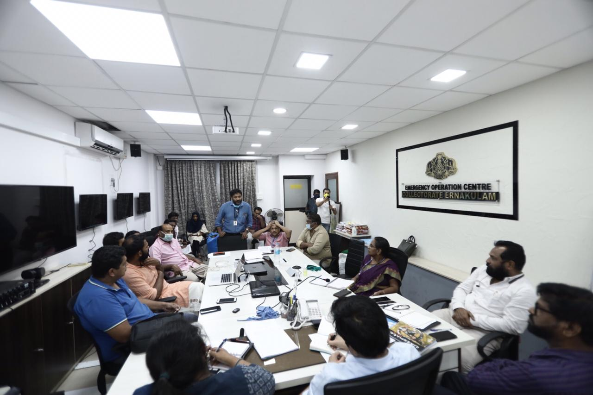

# How to run a mock drill

The mock drill was planned for 24 hours before we had a good idea on how to plan for various scenarios.

* [ ] Identify one key person who can visualise all the scenarios that needs to be tested
* [ ] Review the Plan with the full team.

