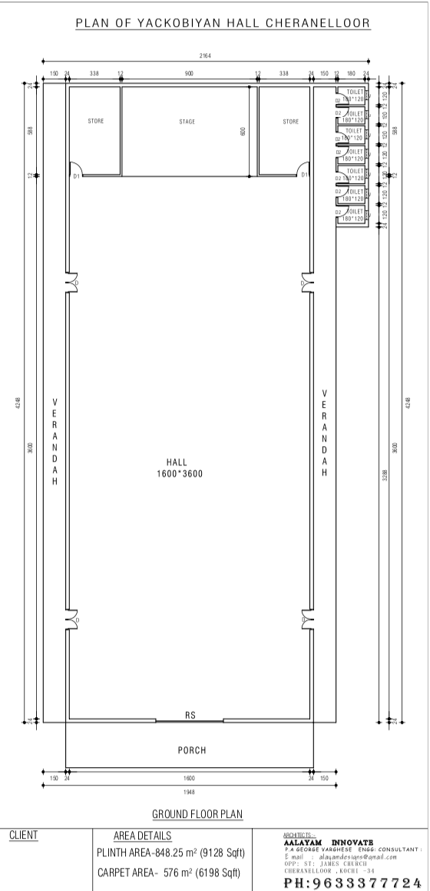
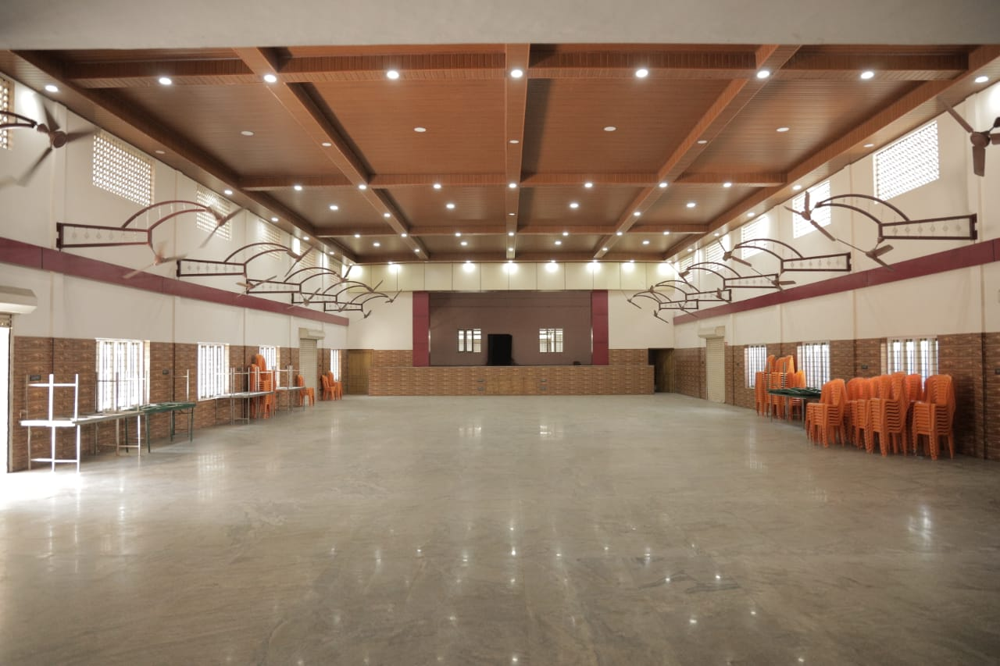
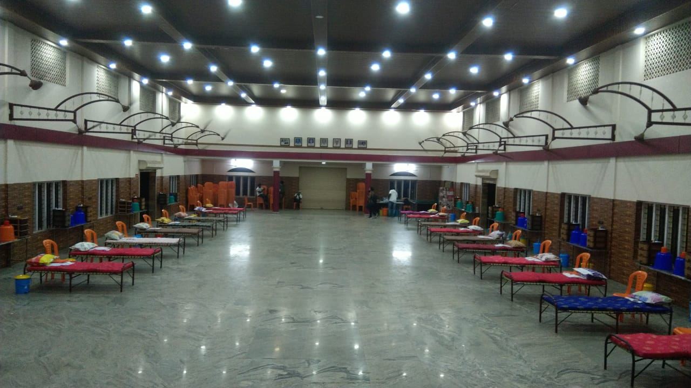
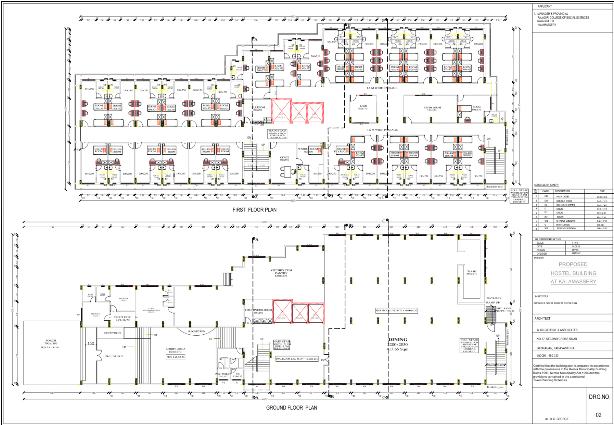
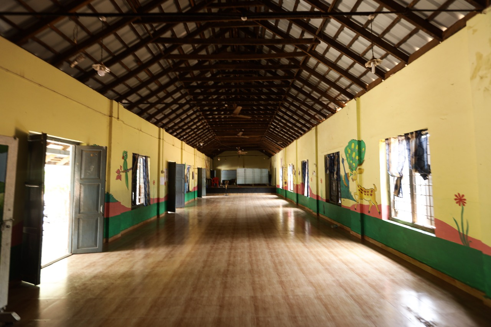
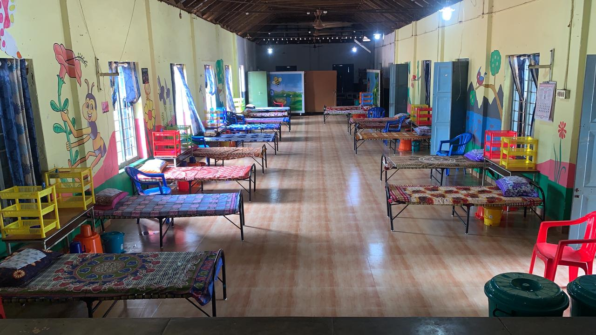

# Setting up the physical facility for Primary Treatment Center

## **Creating a blueprint for Primary Treatment Centers.**

For setting up primary treatment centers, we have to take up open halls which are present across panchayats. Only if we ensure this, can we create a blueprint that can scale across the state and country.  
  
It is important to create and demonstrate a working model for all individuals to understand how to setup and operate a First Line Treatment Center.   
  
**We have created templates out of the following physical spaces.**  

1. Community Halls \(at [Yacobian Hall, St: James Church](https://goo.gl/maps/S8Woz2Cs5JnXBBoQ9), Cheranellor Panchayat, Ernakulam\)
2. Hostel with rooms that have attached bathroom
3. Hostel with rooms that have common bathroom \(Rajagiri College, Kalamasserry Municipality\), 
4. Government UP School \([at Payipra Panchayat](https://goo.gl/maps/us5Wcbf31U3ApuJ78), Ernakulam\)

**The Floor Plans of two of the buildings are attached.**

  

The goal is to develop the minimum viable product on the ground which can be easily replicable across all 19,000 wards in Kerala so that by creating 24,000 centers, a scale of 600,000 beds may be created.  
****

**There are common inventory items that we need to set up**  

1. **Non Medical :** Beds, Mattresses, Pillows, Soap etc
2. **Medical :** IV Stands, Fluids, Pulse Oximeters etc

**Central Common Facilities have to be created for**  

1. Housekeeping and Facilities Management
2. Waste Management
3. Manpower Identification and Training
4. Inventory Management

We have to mobilise inventory planning for common items at the Village Panchayat at each district to enable rapid mobilisation.   
****

